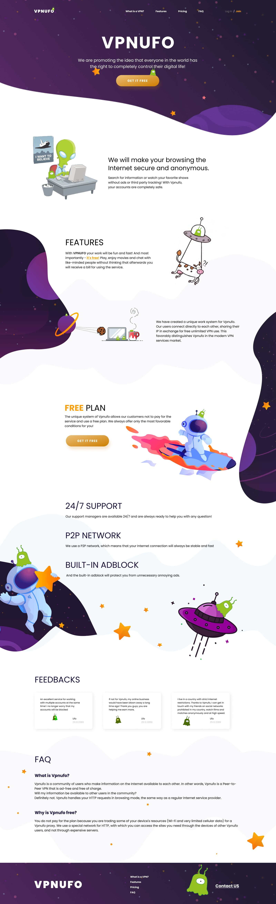
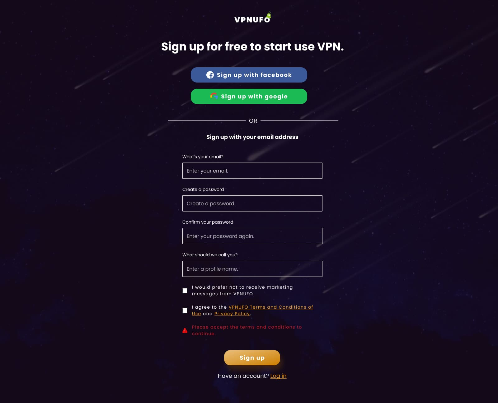
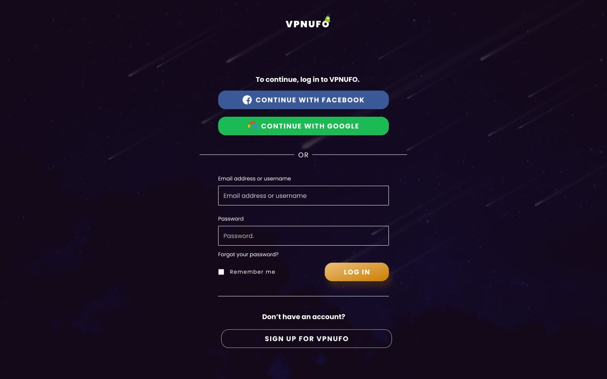
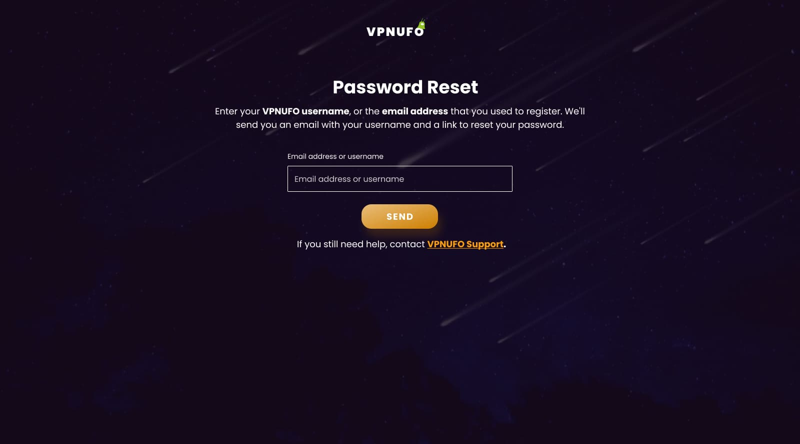
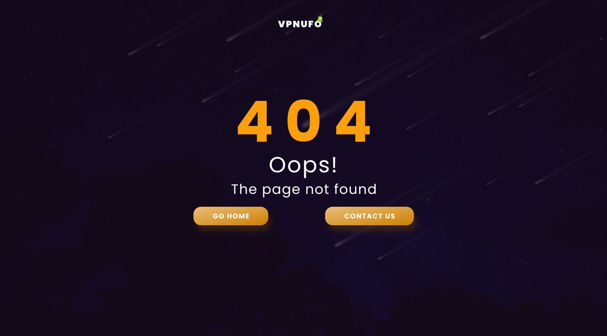

# VPN-UFO

#### Frontend

- NextJS
- Redux, Redux Toolkit
- Apollo
- TypeScript
- SCSS
- Webpack
- Figma

#### Backend

- NestJS
- GraphQL
- MongoDB
- TypeScript

## Figma

https://www.figma.com/file/Kis6CkWtqdEGzAx8cLiiid/VPN-ufo?node-id=0%3A1

## Client

## Server

